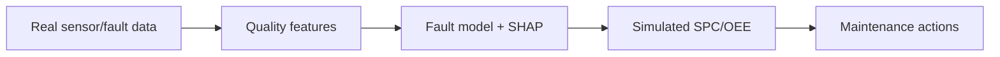

# Architecture

```mermaid
flowchart LR
    N0["Real sensor/fault data"] --> N1["Quality features"]
    N1["Quality features"] --> N2["Fault model + SHAP"]
    N2["Fault model + SHAP"] --> N3["Simulated SPC/OEE"]
    N3["Simulated SPC/OEE"] --> N4["Maintenance actions"]
    N4["Maintenance actions"]
```

## Claim boundary

Mixed real and simulated analysis; each result is labeled by source.
